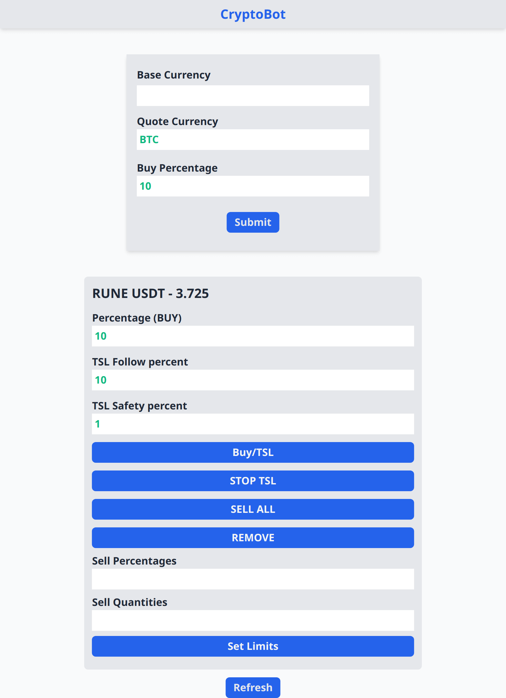

# Binance Bot For Trailing Stop Loss (TSL) With Webgui (For Pumps)

- Binance is a cryptocurrency exchange that provides a platform for trading various cryptocurrencies.

*barebones (prototype) - unstable*
**How to**
1. `pip install -r requirements.txt`
2. `set binance API_KEY, SECRET_KEY as environment variables`
3. `uvicorn cryptoserve.cryptoserve:app`

**Features**
1. Trade Any Asset Pair That Binance Supports
2. Limit Buy/Sell
3. Market Buy/Sell
4. Multiple Limits Sell Order
    *sell arbitrary amount of asset at arbitrary price points.*
    *ex: sell 25% if price falls 5%, 30% if price falls 10% etc ..*
    
5. **Trailing Stop Loss** 
    *TSL (Websocket based) can be set to follow the price at a particular percentage as the price goes up and then execute a limit/market sell when the price falls by the set percentage*
   
6. Multiple Coins/TSLs At The Same Time
7. Very Minimal Web Gui (Proto)
---
**Screenshot** 

___
*Dependencies*
- requests==2.22.0
- python_binance==0.7.9
- unicorn_binance_websocket_api==1.29.0
- starlette==0.14.1
- binance==0.3
- aiofiles==0.7.0
- python-dotenv==0.19.0
- uvicorn==0.14.0